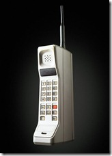

Like most, I've had a lot of mobile phones.&#160; Back in the olden days I was actually an installer for a custom car stereo shop that was also an Ameritech cellular dealer ( Ameritech was later bought by Verizon ). Ever since then I have had many MANY different pagers and phones.&#160; Yes, I said pagers. I've also had my fair share of the famous Motorola "brick". That phone might have been big, but damn it worked good.&#160; True story, I used to drive a Jeep back then and placed that big brick phone on the dash. Took a corner one day and the brick slide across the Jeep and right out the window. Turned around and pick it up and guess what ***it still worked***.

Well I finally got sick of waiting for VZW to get out of bed with Android and got a finally got myself and my wife a Windows Phone. Since my purchase Verizon did start to offer a Windows Phone but regardless I would have switched anyways. As part of this switch my wife finally was upgraded from a standard phone to a smart phone. I will come back to this later. It's only been a couple of weeks but I wanted to share my initial experience and list of applications. I was surprise to see I have managed to install 58 applications already:

1.  7Pass2.  Adobe Reader3.  Amazon Kindle4.  Amazon5.  AP Mobile6.  AVISWP77.  Backgrounds8.  BigOven9.  Bing Picture Downloader10.  Calorie Counter11.  Car Locator for Free12.  CTA Watch13.  DirecTV14.  DriveOn15.  ESPN ScoreCenter16.  Facebook17.  Flickr From Yahoo!18.  Gadget News19.  gMaps20.  GoVoice21.  Huffington Post22.  IMDB23.  KeyRing24.  Marketplace Search25.  My Contact Info26.  My Trips27.  NASCAR News28.  Netflix29.  Podcasts30.  Poynt31.  Public Transit32.  RAD Now33.  Rowi34.  RunKeeper <- not sure why Clark hates to run.35.  Shazam36.  Slacker37.  Stocks38.  Tag Reader39.  Tech New Now40.  TWiT41.  Twitter42.  Unit Converter43.  Walgreens44.  Weather45.  WeatherBug46.  Where47.  Wikipedia48.  WinMilk49.  WordPress50.  Yelp51.  YouTube52.  Ztitch53.  Krashlander54.  Fable Coin Golf55.  Flowers56.  XBOX Live Extras57.  Text Text Revolution58.  Unite  

Now I ran Android for well over a year. I personally wanted to see what all the hype was about. I thought it would be good to also list the applications I ran on it too.&#160; About a month before sidelining it, <strike>I</strike> a friend of mine flashed it to Evervolve-Dives, and to be completely fair this list isn't as complete as it should be but it's darn close. It's definitely the apps I used the most.

1.  Advanced Task Killer
2.  Amazon Kindle
3.  Amazon.com
4.  AmazonBarcode
5.  Angry Birds ( whatever edition you want )
6.  Barcode Scanner
7.  Bing
8.  Chase
9.  DirecTv
10.  Engadget
11.  EventBrite
12.  Evernote
13.  Facebook
14.  GoDaddy Mobile
15.  Google Sky Map
16.  Google Reader
17.  Google Places
18.  IMDB19.  LinkedIn
20.  Pandora
21.  Shazam22.  Skype
23.  Sticher
24.  TripIt
25.  Twitter
26.  Weather Bug
27.  You Tube
28.  TweetDeck
29.  Yelp  

Couple of things have surprised me in this transition, Battery, Applications and WAF.

First and foremost, battery. Battery is a big deal for me, **<u>all I want is a full day under normal usage</u>**. I understand there are times where I might be sitting in an airport constantly on it and I expect it to drain, that is the exception. At the end of the day, I get a day on Windows Phone and I love it!&#160; 

Applications of course, I never paid for an app on Android, NEVER. It's not that I have a problem doing so I just didn't need to. I have bought a number of applications on Windows Phone, especially the good ones. I have no problem paying a few bucks for polish and the hard work that goes into it.&#160; I was really curious how the ecosystem would hold up to what I was used to on Android and it did. That ecosystem was pretty much already there on Windows Phone and just after 8 or so months of its initial launch. Granted there are a few things missing and it's not fair to compare one to one. For example, Bing is built in, awesome no need for another app. Google ships their apps like Places and Reader too. Lastly the thing that really surprised me was the application quality, specifically in regards to UX. It's just drastically better.&#160; The consistency is great and makes for a very enjoyable experience.&#160; This is something Apple has done well with the iPhone. Now that last point I think is two fold, clearly the frameworks will lead people down a particular path but really it's the developer who writes against it. Nothing on Windows phone is forcing you down a certain path but yet the applications are very consistent and very good.

Lastly WAF as [Scott Hanselman](http://www.hanselman.com) has coined the term "WAF" as Wife Acceptance Factor.&#160; I went out on a limb and got my wife her first Smart Phone. She is computer literate, so I wasn't too worried.&#160; At first I got the, "I don't really need that", less than week later I got the "I love it" and she uses it as a tool to make her days more productive. I know that sounds very marketing like but it's true. It took her a couple of days to "figure it out" but once the light bulb went on it was on.

Overall, I love Windows Phone and I am glad I made the transition.&#160; This isn't a Microsoft PSA, I am a customer too.&#160; I personally can't wait for the next release to come out.

So what are your top 3 applications?