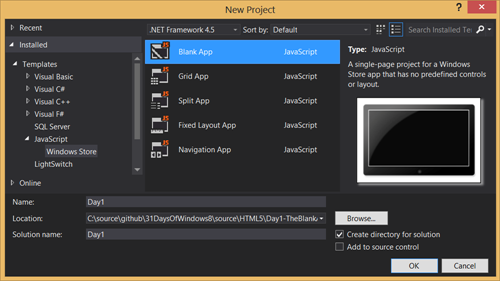
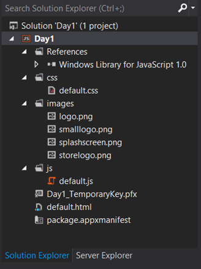
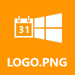
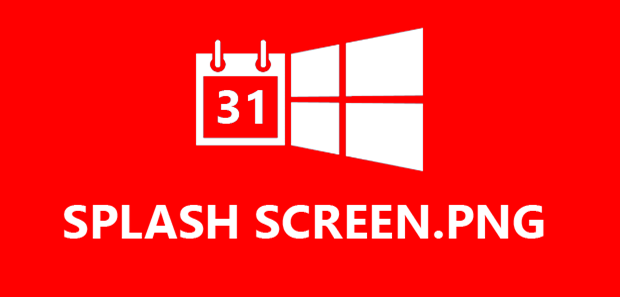
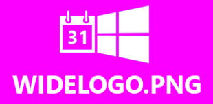
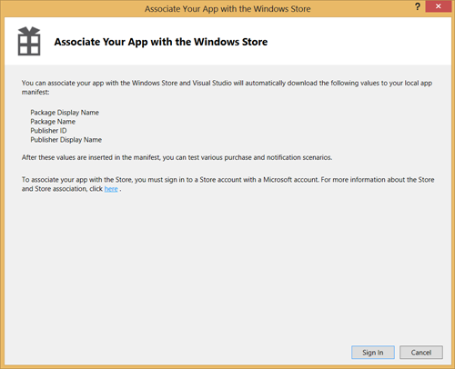

This article is Day #2 in a series called [31 Days of Windows 8](http://31daysofwindows8.com/).  Each of the articles in this series will be published for both [HTML5/JS](http://csell.net/category/windows-8/31-days/) and [XAML/C#](http://www.jeffblankenburg.com/category/31-days-of-windows-8/). You can find all of the resources, tools and source code on our [Website](http://31daysofwindows8.com/).

[![advertisementsample14[2]](advertisementsample142.png "advertisementsample14[2]")](http://31DaysOfWindows8.com/?day=1)

* * *

In the first article of this series, I thought it was important to cover the inner workings of a Windows Store Blank App template in Visual Studio 2012.  I will cover each of the files, why they are important, as well as many of the settings that may be hidden in each one.  This should give you a solid foundation for the rest of the series, where we will be using each of these files.

There are also several other project templates in Visual Studio 2012, specifically _Grid, Split, Fixed _and _Navigation_ as you can see below. They were built with a specific type of application or navigation in mind, and it's generally unlikely that your idea fits that architecture perfectly.  Remember these templates are starting points and not the end solution. For this series we will almost start with the Blank App template.

Here is a view of the Solution Explorer for a brand new Blank App template in a HTML5 solution.

## The Images

Let's start with the easy ones, the images in the **_images_ **folder.  There are four images inside every new project, and they each serve a specific purpose.  We have created different versions of these images (as well as one additional), so that it's very obvious which image is which when we run the application.  I highly recommend downloading these images and replacing the default ones, especially when you're learning.  [You can download all five of them here](http://www.31daysofwindows8.com/content/defaultimages.zip).  Once you have replaced the default images, run your project to see these images in each of their locations, as described below.

#### Logo.png

This is probably the most common image your application will use.  This is the default background image for your application's tile on the user's Start screen.  It is 150 x 150 pixels in size.

#### SmallLogo.png

This image is used when an application list is shown.  For example, when you search for an application in Windows 8, or in the Share menu.  The SmallLogo.png is 30 x 30 pixels.  At such a small size, you want to make sure this icon really represents something familiar to your user.  I highly recommend just a logo or some other obvious imagery.

#### SplashScreen.png

This  is the initial image that loads when your application is started.  There are some neat tricks you can do with this, and we will cover those later in this series.  For now, remember that this image will ALWAYS be 620 x 300 pixels, and will be vertically and horizontally centered on your user's screen, regardless of size.

#### StoreLogo.png

To save space in the store, we have a smaller icon that is used.  This image is 50 x 50 pixels, but might be the most important 2500 pixels in your entire application.  This is the icon that users will see when they are deciding which new apps to add to their device.  A poor icon indicates a poor application to most users.  Spend some time on this one.

#### WideLogo.png

This is an additional icon that I include in my initial projects.  You will need to add it to your project by right-clicking on the **Assets** folder and choosing "Add Existing Item..."  This image is 310 x 150 pixels, and is used to allow your application to have a wider tile than the standard size of Logo.png.

## package.appxmanifest

This file contains all of the configuration, settings, and declarations for your application.  It is where you will go for almost every single thing that is related to your app running on a Windows 8 machine.  For example, this is where you define that the search contract is enabled, or which icons to use in each situation. For example, each of those image assets we just walked through are defined in the _Application UI Tab _of the _AppXManifest._  It also defines default background colors, orientations, and specific capabilities your app will require, like access to location.

Make sure you are intimately familiar with this file.  You're going to need it.

## default.html

This is our main entry point or starting page of your application. _default.html_ could actually be named anything, as it's set in our package.appxmanifest file as the application's start page. As a web developer _default.html_ should look like any other starting page for a website you've created especially if you've done any HTML5.
<pre class="prettyprint"><!DOCTYPE html>
<html>
<head>
    <meta charset="utf-8" />
    <title>Day1</title>

    <!-- WinJS references -->
    <link href="//Microsoft.WinJS.1.0/css/ui-dark.css" rel="stylesheet" />
    
    

    <!-- Day1 references -->
    <link href="/css/default.css" rel="stylesheet" />
    
</head>
<body>
    
Content goes here

</body>
</html></pre>
Like any html page you've seen, you will find our references to style sheets and script files. But look closely at the _href_ or _src _for a the _link _and _script_ respectively. Take note of the // as the start of the path. This is how we reference the built in scripts and style sheets.

## css/default.css

Since we started with the blank template, you should be able to guess that our default style is also non existent. Having said that there are a few clues as to what Microsoft wants us to do at the minimum, orientation and snapping. Tomorrow we will cover orientation and snapping in details but for not it's enough to say it's handled by some simple media queries.
<pre class="prettyprint">body {
}

@media screen and (-ms-view-state: fullscreen-landscape) {
}

@media screen and (-ms-view-state: filled) {
}

@media screen and (-ms-view-state: snapped) {
}

@media screen and (-ms-view-state: fullscreen-portrait) {
}</pre>
Now default.css wasn't the only style sheet our template referenced. We also referenced:
<pre class="prettyprint"><link href="//Microsoft.WinJS.1.0/css/ui-dark.css" rel="stylesheet" /></pre>
&nbsp;

This is a build in style sheet our applications can use to help us consistently style things like the built in controls. The template referenced the "dark" style by default but there is also a "light" style as seen here:
<pre class="prettyprint"><link href="//Microsoft.WinJS.1.0/css/ui-light.css" rel="stylesheet" /></pre>

## js/default.js

Unlike our default CSS, our default JavaScript file does do stuff specifically around process lifecycle management or PLM. Out of the box our template is setting up some shell behavior to handle some of the different PLM cycles like launching and terminated. These are things we will want to implement
<pre class="prettyprint">(function () {
    "use strict";

    WinJS.Binding.optimizeBindingReferences = true;

    var app = WinJS.Application;
    var activation = Windows.ApplicationModel.Activation;

    app.onactivated = function (args) {
        if (args.detail.kind === activation.ActivationKind.launch) {
            if (args.detail.previousExecutionState !== activation.ApplicationExecutionState.terminated) {
                // TODO: This application has been newly launched. Initialize your application here.
            } else {
                // TODO: This application has been reactivated from suspension.Restore application state here.
            }
            args.setPromise(WinJS.UI.processAll());
        }
    };

    app.oncheckpoint = function (args) {
    };

    app.start();
})();</pre>

Just like in our CSS, we have also referenced some built in libraries, specifically WinJS. We need WinJS to implement things like PLM. More on WinJS later.

<pre class="prettyprint">   
   </pre>

## Day1_TemporaryKey.pfx

Every Windows Store app is signed by a certificate. When you first create a new project in Visual Studio it will create a new test certificate automatically. In our case this test certificate is called _Day1_TemporaryKey.pfx_ where _Day1 _is our project name. Again you can find this set in the _package.appxmanifest_ file under the _Packaging _tab. You can even create new certificates there, if needed.

Once your ready to submit to the store you will need to associate your application with the Microsoft Store and your Developer Account. You can do this by going to _Projects, Store, Associate App with the Store..._ After doing so, you will notice a new certificate will be added to your project, which will be used to sign the final package.

You can find more information about [signing an app package here](http://msdn.microsoft.com/en-us/library/windows/apps/br230260.aspx).

## Summary

So that's it!  We're only just getting started in this series, but you've now gotten a solid understanding of starting files found in a default Blank App template for HTML.

Tomorrow, we are going to focus on orientation and snapping, two important aspects of your application that often go overlooked.  If you haven't already, download the free tools to build apps for Windows 8 from the link below. I have also included a link to the entire solution mentioned here today.

See you tomorrow!