This article is Day #20 in a series called [31 Days of Windows 8](http://31daysofwindows8.com/).  Each of the articles in this series will be published for [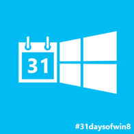](http://31daysofwindows8.com/?days=20)both [HTML5/JS](http://csell.net/category/windows-8/31-days/) and [XAML/C#](http://www.jeffblankenburg.com/category/31-days-of-windows-8/). You can find additional resources, downloads, and source code on our [website](http://www.31daysofwindows8.com/).

Today, it's all about creating paper. Yes folks, the joys of printing. I know for some this might feel very 1999 but as it turns out, people are still using paper. There is not doubt that over the past 10 years we've seen this landscape change with things like the cloud and tools like [OneNote](http://apps.microsoft.com/webpdp/en-us/app/onenote/f022389f-f3a6-417e-ad23-704fbdf57117) or [Evernote](http://evernote.com/), but I think it's safe to say we're still printing.

For me, printing from the applications we've built has been nothing short of a royal pain. It's always been that feature which was expected but never planned for and if it was, there was never really any "real" thought put into it. Sad I know, I hope you're not in that boat too.

While I was thinking out how to write this article, it dawned on me. Print should really be thought of like any UX screen you might design for your application. This may be obvious for some but I had a few ah-ha moments here. Print is really just another medium. It's paper with a different resolution. Sure we have to walk over to the printer and physically grab it, but unlike our mobile and tablet industries we can at least predict the resolution we plan to support. Because of that, treat it no different than you would any other UX screen you might design.

Our purpose for today isn't to help you design what your print screens could look like but rather how can we take data and prepare of for print. Warning now, ugly UX for both paper and screen.

Now, no real paper was used in the making of this article, as it turned out I ran out of ink.

## Start

Printing is simple. I won't lie, that statement was one I never thought I would make. I've been on { cough: wpf projects of yesteryear } where printing, while possible was an just a nightmare. Thankfully that was yesteryear and we can all move on.

To start exploring this, I created the same simple Blank App project we've done for the past 20 days. Fire up your app and open the charms menu. From there, select the Devices Charm.

[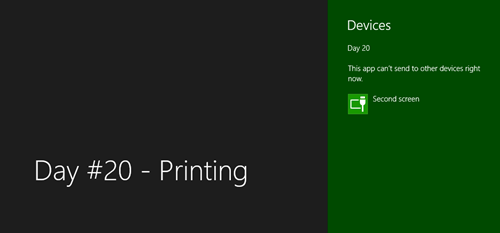](http://csell.net/wp-content/uploads/2012/11/image50.png)

As you might expect the the Devices Charm is our contract into the physical devices we can interact with. At this point ( and we haven't done anything yet ) you can see all we really can't do anything. Let's register for printing.
<pre class="prettyprint">var _printManager = Windows.Graphics.Printing.PrintManager,
    _printView = _printManager.getForCurrentView();

_printView.onprinttaskrequested = function (eventArgs) {
    eventArgs.request.createPrintTask("31 Days", function (args) {
        args.setSource(MSApp.getHtmlPrintDocumentSource(document));
    });
};</pre>
Now let's re-run and select the Devices Charm again.

[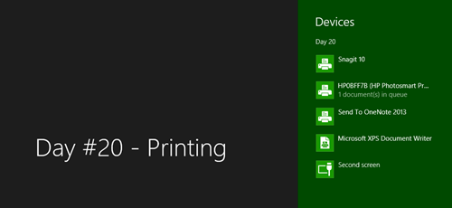](http://csell.net/wp-content/uploads/2012/11/image51.png)

Now, our devices charm is stacked full of options that I can print to. Let's select Microsoft XPS Document Writer and my actual printer just to see what we get.

[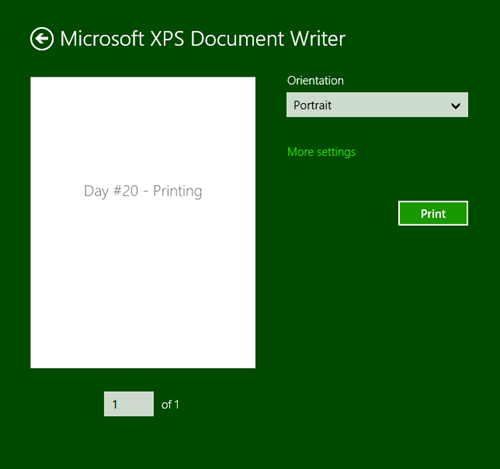](http://csell.net/wp-content/uploads/2012/11/image52.png)

[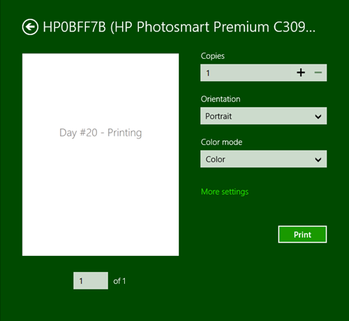](http://csell.net/wp-content/uploads/2012/11/image53.png)

While my print view is the same, my options for the devices are clearly different based upon the capabilities of that device. Regardless, we've printed! Now my current layout is really nothing close to special, so what if I had 90 paragraphs of [Bacon Ipsum](http://baconipsum.com)?

[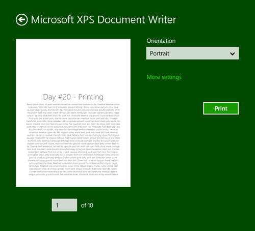](http://csell.net/wp-content/uploads/2012/11/image54.png)

You can see above, our layout automatically adapted. The 90 paragraphs that I added was actually just the content of one 
 element. This translated into 10 pages of content with even margins on the bottom, or did it?

For those who've worked with printing in the past, know that's pretty cool. And while this is all fine and dandy, chances are my screen layout isn't really what I want to print.

## Layout

So far our print has been a direct representation of our screen. And while our app is nothing more than a centered header and a paragraph it's a terrible usage of paper. For now let's continue to assume this app is awesome and the UX has been designed by the greatest of greats.

[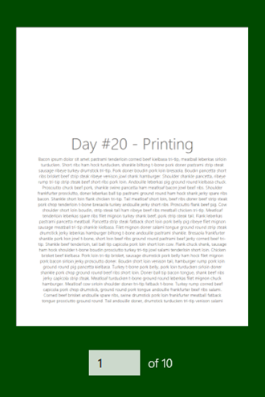](http://csell.net/wp-content/uploads/2012/11/image55.png)

But we can safely say this layout just doesn't work on paper. What we really want to do is reformat things so they are better suited to the medium of which they would be displayed on, in this case our paper. it would be much better here if we moved the title to at least the top of the page. Well guess what, CSS to the rescue.
<pre class="prettyprint"><link href="/css/print.css" rel="stylesheet" type="text/css" media="print" /></pre>
There is nothing special about adding another stylesheet except here we're going to leverage the [media attribute](http://www.w3.org/TR/CSS21/media.html): _media="print"_. With this new CSS stylesheet in place, when the user selects to print Windows will use that stylesheet for the view. Now all I did in my stylesheet is readjust my CSS Grid and the text alignment. The result:

[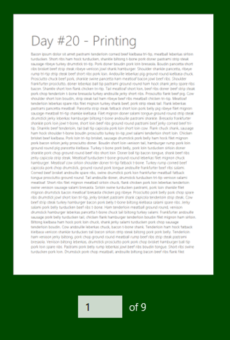](http://csell.net/wp-content/uploads/2012/11/image56.png)

Clearly that works so much better for a piece of paper. But couldn't I just use a media query because that seems so much more HTML5-ish? Yes, you can do the same. This works exactly like things do in the browser.
<pre class="prettyprint">@media print {
    body {

        width: 100%;
        height: 100%;

        display: -ms-grid;
        -ms-grid-columns: 1fr;
        -ms-grid-rows: 1fr;
    }

    #content {
        -ms-grid-column: 1;
        -ms-grid-row: 1;

        text-align: left;
    }

}</pre>
Of course this is nothing more than what we've already done in our Websites today.

## Adding Print Button

So far we've used the built in Devices Charms to send something to a device that claims it can print. While it's [recommended](http://msdn.microsoft.com/en-us/library/windows/apps/hh868178.aspx) to always use the Devices Charm there might be a scenario in which your application needs to have it's own print button. If this is in fact the case, we can easily do so by showing the same print UI that the Devices Charm would.

To do so, I've added a button to my screen which will fire the handler you will see below.
<pre class="prettyprint">_printThis.addEventListener("click", function () {
    Windows.Graphics.Printing.PrintManager.showPrintUIAsync();
}, false);</pre>
Now to show the PrintUI your screen will still need to register with the Print Manager, like we did at the start of this article. After adding our print button this lead to an unfortunate byproduct. We now have that button element displayed on our screen. meh..

[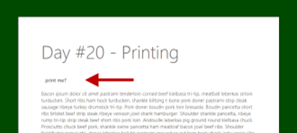](http://csell.net/wp-content/uploads/2012/11/image57.png)

In designing our UX we're really going to want to think about our screens, the content and how we plan to transform it. Thankfully the movement to a more responsive web has been leading us down this path for sometime now.  But let's get rid of that button for our print view. We can simply update our media query or our separate stylesheet to remove that element.
<pre class="prettyprint">@media print {
    /* .... */ 

    button {
        display: none;
    }
}</pre>

## Options

You have options!! Let's start by looking at what's called the [standard options](http://msdn.microsoft.com/en-us/library/windows/apps/hh761453.aspx). These are the options that are display to the right hand side of the preview of your document. You can see I have highlighted them in red below.

[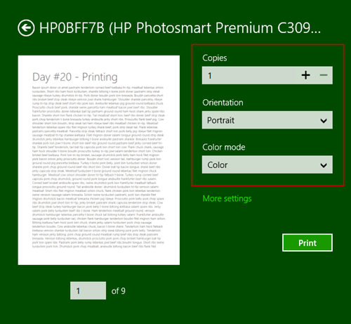](http://csell.net/wp-content/uploads/2012/11/image58.png)

By default the same three properties are always presented ( unless you clear them out ); [Copies](http://msdn.microsoft.com/en-us/library/windows/apps/windows.graphics.printing.standardprinttaskoptions.copies.aspx), [Orientation](http://msdn.microsoft.com/en-us/library/windows/apps/windows.graphics.printing.standardprinttaskoptions.orientation.aspx) and [Color Mode](http://msdn.microsoft.com/en-us/library/windows/apps/windows.graphics.printing.standardprinttaskoptions.colormode.aspx). Now we have the ability to change that. Let's assume we _only_ want to present the Color Mode option. I simply clear out my list and add back in the ones I want.
<pre class="prettyprint">_printView.onprinttaskrequested = function (eventArgs) {
    var printTask = eventArgs.request.createPrintTask("31 Days", function (args) {

        printTask.options.displayedOptions.clear();
        printTask.options.displayedOptions
            .append(_printing.StandardPrintTaskOptions.colorMode);

        args.setSource(MSApp.getHtmlPrintDocumentSource(document));
    });
};</pre>
[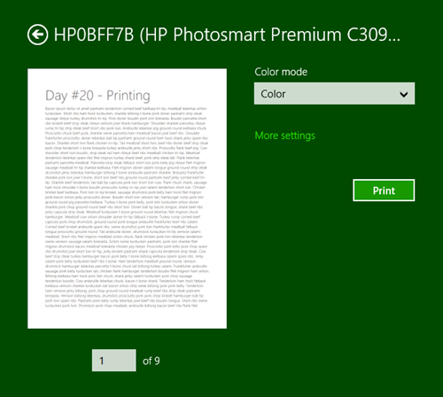](http://csell.net/wp-content/uploads/2012/11/image59.png)

Now, regardless of what I have chosen to display on the standards settings menu when the user chooses the detailed settings menu they will be presented with it regardless.

[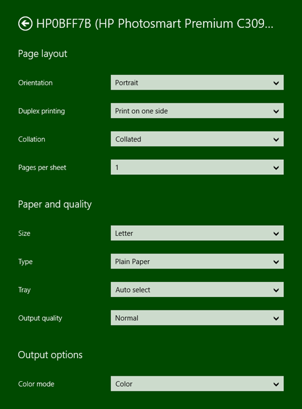](http://csell.net/wp-content/uploads/2012/11/image60.png)

We can also choose what we feel the default setting should be. Maybe we really wanted the Color Mode to be set to grayscale rather than color.
<pre class="prettyprint">printTask.options.colorMode = _printing.PrintColorMode.grayscale;</pre>
Of course we can also add to the standard list as well. Let's say you want the default options + duplex printing. Rather than clearing out the default list you would just add to it.
<pre class="prettyprint">printTask.options.displayedOptions
    .append(_printing.StandardPrintTaskOptions.duplex);</pre>
Now with all of this, the only option supported by your device are the ones which will get shown. A great way to see this in action is to select the XPS Document Writer rather than you printer. Regardless of what you may have just set, it's not there for XPS.

What about [custom printing features](http://msdn.microsoft.com/en-us/library/windows/apps/xaml/hh973533.aspx)? Well that currently isn't supported by HTML5\JavaScript like it is in XAML\C#.

## Other Events

As with any page, it's important to understand our [navigation model](http://31daysofwindows8.com/?day=13) and when we should be loading and unloading our events. The same applies with printing as well. There are [4 events as part of the PrintTask](http://msdn.microsoft.com/en-us/library/windows/apps/windows.graphics.printing.printtask.aspx#events); Completed, Previewing, Progressing and Submitting.

I am not going to go through all of the events but I do want to look at completed since it's the one place we can see if we were actually able to print.
<pre class="prettyprint">_printView.onprinttaskrequested = function (eventArgs){
    var printTask = eventArgs.request.createPrintTask("31 Days", function (args) {

        printTask.oncompleted = printCompleted;

        /* .... */
    });

function printCompleted(eventArgs) {

    switch (eventArgs.completion) {
        case _printing.PrintTaskCompletion.failed:
            break;
        case _printing.PrintTaskCompletion.submitted:
            break;
        case _printing.PrintTaskCompletion.abandoned:
            break;
        case _printing.PrintTaskCompletion.canceled:
            break;
        default:
            break;
    }    
}</pre>
As you can see we register for the event once our Print Task is created. Then we can just switch over the result and react as we see fit. Honestly it should be as you would expect. That's a good thing.

## Summary

Today, we stepped into the devices contract, specifically our ability to print. I've tried to break down printing in such a way that it was simple knowing full well, the complexity of printing comes from our use cases. Transforming the pixels on the screen, to a piece of paper is no easy task and it takes a thoughtful design to be effective. That isn't a simple feat and it should be treated just like any other feature on your development project. Unfortunately that isn't something we can help you with.

If you would like to download the sample code that was discussed in this article, click the icon below:

Tomorrow, we're going to take a look at capturing images from your Camera. See you then!

