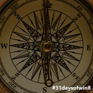

This article is Day #23 in a series called [31 Days of Windows 8](http://31daysofwindows8.com/).&nbsp; Each of the articles in this series will be published for both [HTML5/JS](http://csell.net/category/windows-8/31-days/) and [XAML/C#](http://www.jeffblankenburg.com/category/31-days-of-windows-8/). You can find additional resources, downloads, and source code on our [website](http://www.31daysofwindows8.com/).

Today, we're going to talk about the compass. While we've talked about one sensor in the past ([Orientation Sensor](http://csell.net/2012/11/02/31-days-of-windows-8-day-2-orientation-snap)), this is the first article of many to come focused just on the supported sensors. As a web developer this is really something completely new for me as it's really outside the bounds of what we might typically do. Having said our web world is changing ever so fast.

Now if you've ever done any phone development then this isn't anything new as our phones ( especially the ones on the shelf today ) have had these capabilities. If you have done any Windows Phone development previously, you might have read Jeff's [article on the Windows Phone compass](http://www.jeffblankenburg.com/2011/11/04/31-days-of-mango-day-4-compass), which provides magnetic and true north headings, as well as X, Y, and Z rotation data.

In Windows 8 this is different and provides significantly less data from the compass sensor.&nbsp; In fact, we only get the values related to our heading, with no consideration for rotation data.&nbsp; In addition, you're going to find that since we're building apps for Windows 8, there's going to be a wide variety of sensors we'll encounter. Now having said that, we can get rotation from the orientation sensor which we've already talked about on [day #2](http://csell.net/2012/11/02/31-days-of-windows-8-day-2-orientation-snap). I would also check out this [quick start on retrieving the quaternion and rotation matrix](http://msdn.microsoft.com/en-us/library/windows/apps/hh465270.aspx) if you're interested more in rotation.

Ok, on with the show.

## Writing Some Code to Access the Compass

The compass, like many of the sensors we will cover over over the next few days, the compass is actually very accessible and easy to use.&nbsp; With a few lines of code, and one event handler, we can gather rich data from our user's device very quickly.&nbsp; Here's is all the code I needed to to start getting real-time data from my simple compass app:
<pre class="prettyprint">    var _trueNorth, _magNorth, _timestamp;

    function onReadingChanged(e) {
        var newReading = e.reading;
        _timestamp.innerText = newReading.timestamp;
        _magNorth.innerText = newReading.headingMagneticNorth.toFixed(2);

        if (newReading.headingTrueNorth != null) {
            _trueNorth.innerText = reading.headingTrueNorth.toFixed(2);
        }
    }

    function startCompass() {
        var compass = Windows.Devices.Sensors.Compass.getDefault();

        if (compass) {
            var minimumReportInterval = compass.minimumReportInterval;
            var reportInterval = minimumReportInterval > 16 ? minimumReportInterval : 16;
            compass.reportInterval = reportInterval;

            compass.addEventListener("readingchanged", onReadingChanged);
        }
    }

    function getDomElements() {
        _trueNorth = document.querySelector("#trueNorth");
        _magNorth = document.querySelector("#magNorth");
        _timestamp = document.querySelector("#timestamp");
    }

    app.onloaded = function () {
        getDomElements();
        startCompass();
    }</pre>

To explain the code above, in my _startCompass()_ method, I try to initialize my Compass object, and if it's not null ( meaning there is a compass sensor on the machine ), I create an event handler for each time that the reading of the compass changes.&nbsp; (Unless the user's device is sitting completely still, it's likely you'll consistently get new readings.)&nbsp; In the _onReadingChanged_ event handler, I then assign our three values, _HeadingMagneticNorth_, _HeadingTrueNorth_, and _Timestamp_ to an element I declared in our markup.

That's it.&nbsp; As you probably saw, however, most of the sensors you're going to encounter will not provide ( as mine didn't either ) a _HeadingTrueNorth _value, so relying on the _HeadingMagneticNorth_ is going to be a more reliable value for you.

Finally, both of the Heading values are measured in degrees relative to their associated heading.&nbsp; This means that you'll see a range of values from 0 to 360, with zero being the value headed directly north.

## Summary

This was a quick but exhaustive look at the Compass in Windows 8.&nbsp; We saw that you can easily access the Compass data by using an event handler, but that we receive a limited amount of data from this sensor, and your mileage will vary from device to device.

If you would like to download the sample app featured in this article, click the icon below:

Tomorrow, we're going to look at the light sensor, and how we can manipulate our application to take advantage of knowing if the user is sitting in a light or dark room.

